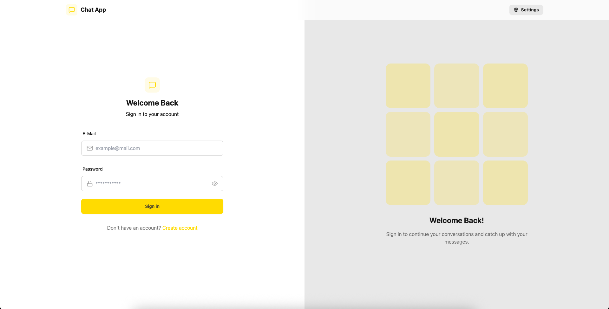
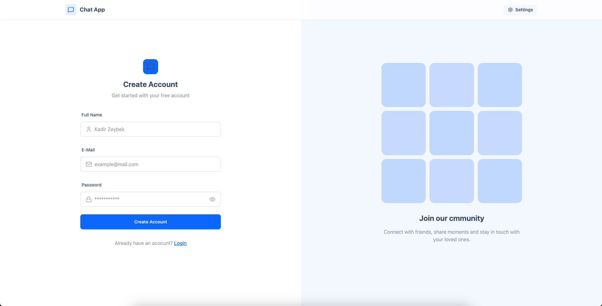
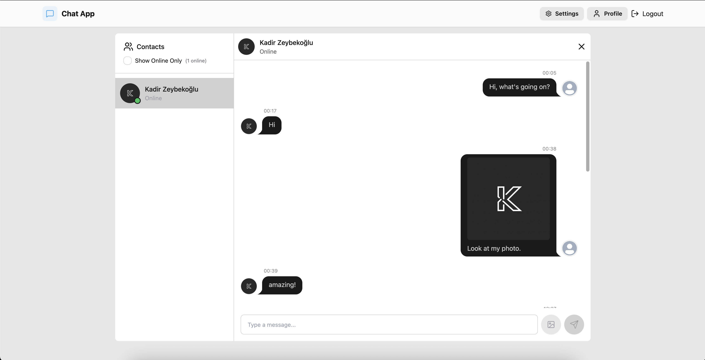
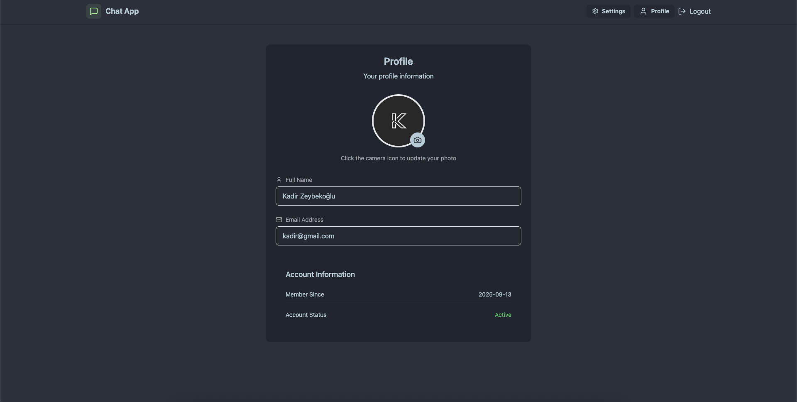
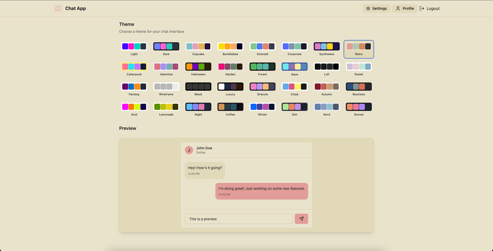

# MERN - Product Store


A MERN project built with **React Vite**, **tailwincss**, **daisyUI**, **Node.js**, and **MongoDB**, **cloudinary**.
This application provides a full chat app system for communication a modern and responsive UI.
---
## Screenshots
|  Login Page |  Sign Up Page | Chatbox Page |
|-------------------|-------------------|-------------------|
|  | | |

|  Profile Page |  settings Page | 
|-------------------|-------------------|
|  | |

---
## Features
### Backend
- Create a new account  
- login account
- Send a message or image to others 
- Update your profile picture 
- Update website template  
- MongoDB integration with Mongoose  
- Tested with Postman  

### Frontend
- Built with React.js, tailwindcss and daisyUI
- Product list with responsive design
- Add, update, and delete products directly from the UI
- User-friendly design with daisyUI
---

## Tech Stack
- **Frontend:** [React vite](https://vite.dev/) with [daisyui](https://daisyui.com/)
- **Backend:** [Node.js](https://nodejs.org/), [Express.js](https://expressjs.com/)  
- **Database:** [MongoDB](https://www.mongodb.com/) with [Mongoose](https://mongoosejs.com/) and upload images cloud with [cloudinary](https://cloudinary.com/)
- **Testing:** [Postman](https://www.postman.com/)  
---

## Installation & Setup

1. Clone the repository  
    `git clone https://github.com/kadrzeybek/MERN-chat_app.git`

2. Create a .env file in the backend folder
    ```
    MONGODB_URI=mongodb+srv://exampleURI
    
    PORT=5001

    JWT_SECRET=LP5FjKejFT6HSf05PaKfN95yrJyFLj0DOEyelRjA16g=     

    CLOUDINARY_CLOUD_NAME=exampel
    CLOUDINARY_API_KEY=key
    CLOUDINARY_API_SECRET=secret_api

    NODE_ENV=development

    ```
    
3. Install dependencies in the root directory
    `npm run build` --> this code will downloads all dependencies and creates a dist doc for running frontend and backend together for deployment
   
4. Start The Server in the backend folder --> this code will run backend server
    `cd backend`
    `npm run dev`

5. Open a new terminal, navigate to the frontend directory, and run the following command to start the frontend in development mode:
    `cd frontend`
    `npm run dev`

6. You can now access the project in your browser at:
     `http://localhost:5173`
